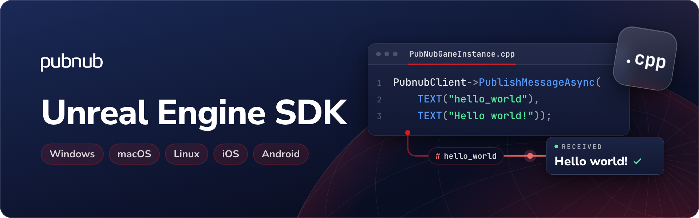

# PubNub Unreal Engine SDK

[](https://www.fab.com/listings/9501a8d6-f9e6-4cf8-8b56-d173bdb71fc4)

PubNub provides global infrastructure for real-time, interactive applications.

Publish and receive messages in Unreal Engine. Use this SDK for Unreal Engine applications using Blueprints or C++.

[Documentation](https://www.pubnub.com/docs/sdks/unreal) · [API reference](https://www.pubnub.com/docs/sdks/unreal/api-reference/publish-and-subscribe) · [Changelog](https://www.pubnub.com/docs/sdks/unreal/changelog) · [Support](https://support.pubnub.com/)

## Requirements

| Requirement | Supported version or setup |
| --- | --- |
| Unreal Engine | [Unreal Engine 5.2–5.7 through FAB; 5.0–5.7 from source](https://www.pubnub.com/docs/sdks/unreal/platform-support) |
| Target platforms | [Windows, macOS, Linux/Unix, iOS, and Android](https://www.pubnub.com/docs/sdks/unreal/platform-support) |
| C++ module | For C++ projects, add `"PubnubLibrary"` to `PrivateDependencyModuleNames` in the project's `.Build.cs` file. |

## Installation

Install the SDK from FAB. For source installation, clone the repository into the project's `Plugins/Pubnub` directory:

```sh
git clone https://github.com/pubnub/unreal-engine.git Plugins/Pubnub
```

For other installation methods, see the [Unreal SDK documentation](https://www.pubnub.com/docs/sdks/unreal).

## Quickstart

This example runs in an Unreal Engine C++ project. It subscribes to `hello_world`, publishes one message, and prints the received text.

### Get your keys

1. Open the [PubNub Admin Portal](https://admin.pubnub.com/).
2. Create an app and a keyset for development, or select an existing development keyset.
3. Copy its publish key and subscribe key.

For a distributed game client, obtain a scoped token from your trusted backend and call `PubnubClient->SetAuthToken(Token)` before accessing protected resources. Never ship the secret key in the game.

### Send and receive a message

Create the PubNub client from `UPubnubSubsystem` in a GameInstance or other session-owned class. Keep the client as a `UPROPERTY()` member. Include `PubnubSubsystem.h`.

Replace the key placeholders. Use a User ID that identifies the user or device in your app.

`PubnubClient` below is a `UPROPERTY() TObjectPtr<UPubnubClient>` on that class. Call this from a context that has `GetGameInstance()`, such as `BeginPlay`.

```cpp
UPubnubSubsystem* PubnubSubsystem = GetGameInstance()->GetSubsystem<UPubnubSubsystem>();

FPubnubConfig Config;
Config.PublishKey = TEXT("YOUR_PUBLISH_KEY");
Config.SubscribeKey = TEXT("YOUR_SUBSCRIBE_KEY");
Config.UserID = TEXT("hello-world-user");

PubnubClient = PubnubSubsystem->CreatePubnubClient(Config);

PubnubClient->OnMessageReceivedNative.AddLambda([](const FPubnubMessageData& Message)
{
    UE_LOG(LogTemp, Log, TEXT("%s"), *Message.Message);
});

PubnubClient->SubscribeToChannel(TEXT("hello_world"));

// Subscription setup can take a moment before the client can receive messages.
FPlatformProcess::Sleep(2.0f);

PubnubClient->PublishMessageAsync(TEXT("hello_world"), TEXT("Hello world"));

// Give the message time to arrive, then leave the channel.
FPlatformProcess::Sleep(2.0f);
PubnubClient->UnsubscribeFromChannel(TEXT("hello_world"));
```

### Run the example

Build the project and start Play In Editor.

The Unreal Output Log should show:

```text
Hello world
```

The example calls `UnsubscribeFromChannel` after the message has had time to arrive. Keep the `UPubnubClient` strongly referenced for the owning session, unsubscribe listeners and channels when they are no longer needed, and destroy the client with its owning Unreal lifecycle. Reuse one PubNub client for the user or session rather than creating a client for every operation.

For a complete application, see [the getting started guide](https://www.pubnub.com/docs/sdks/unreal).

## Next steps

| Task | Documentation |
| --- | --- |
| Configure the client | [Configuration](https://www.pubnub.com/docs/sdks/unreal/api-reference/configuration) |
| Work with subscriptions and messages | [Publish & Subscribe](https://www.pubnub.com/docs/sdks/unreal/api-reference/publish-and-subscribe) |
| Check channel occupancy | [Presence](https://www.pubnub.com/docs/sdks/unreal/api-reference/presence) |
| Read message history | [Message Persistence](https://www.pubnub.com/docs/sdks/unreal/api-reference/storage-and-playback) |

## Build with an AI coding assistant

The [PubNub MCP server](https://www.pubnub.com/docs/ai/pubnub-mcp-server) gives an AI coding assistant access to PubNub SDK documentation and PubNub APIs. Connect the assistant to the hosted server at `https://mcp.pubnub.com`, or run `npx @pubnub/mcp@latest` locally.

The [server repository](https://github.com/pubnub/pubnub-mcp-server) has setup steps for VS Code, Cursor, Claude Code, Claude Desktop, Codex, Gemini CLI, and OpenCode.

## Before production

Use [Access Manager](https://www.pubnub.com/docs/sdks/unreal/api-reference/access-manager) to grant each client the permissions it needs. Keep the secret key on your backend. Never include it in a distributed client.

Create `UPubnubClient` from `UPubnubSubsystem` and keep it for the owning game or session lifetime. Call `UnsubscribeFromChannel` when an individual channel is no longer needed, `UnsubscribeFromAll` to stop all subscriptions, and `DestroyClient` when the client itself is no longer needed. Use `SetAuthToken` with a backend-issued token in distributed clients.

Live delivery through PubNub SDKs is at-most-once. A subscriber can miss messages while disconnected or if its buffer overflows. For longer-gap recovery, see [Message Persistence](https://www.pubnub.com/docs/sdks/unreal/api-reference/storage-and-playback).

## Troubleshooting

| Symptom | Check |
| --- | --- |
| C++ build cannot resolve PubNub headers or module symbols | Add `"PubnubLibrary"` to `PrivateDependencyModuleNames`, regenerate project files if necessary, and rebuild. See the [Unreal SDK](https://www.pubnub.com/docs/sdks/unreal). |
| A publish succeeds but no message appears | Check the message handler, subscription readiness, keyset, and channel name. |
| A packaged Blueprint project fails although it works in Editor | Follow the packaging-specific fixes in [Unreal troubleshooting](https://www.pubnub.com/docs/sdks/unreal/troubleshoot), including the documented Blueprint-only packaging requirements. |
| Extra clients or duplicate messages during development | Own the PubNub client and listeners at GameInstance or another session-lifetime scope rather than recreating them whenever an Actor is reconstructed. |

For setup help, see [troubleshooting](https://www.pubnub.com/docs/sdks/unreal/troubleshoot). Check [network status](https://status.pubnub.com/) for service incidents.

## Releases

Read the [changelog](https://www.pubnub.com/docs/sdks/unreal/changelog) before upgrading.

For a major version change, follow the [Unreal SDK 2.x migration guide](https://www.pubnub.com/docs/sdks/unreal/migration-guides/unreal-v2-migration-guide) and review the [changelog](https://www.pubnub.com/docs/sdks/unreal/changelog).

## Support and contributions

For setup or account help, contact [PubNub Support](https://support.pubnub.com/).

For a reproducible SDK bug, use [GitHub Issues](https://github.com/pubnub/unreal-engine/issues). Include the SDK version, runtime, and a small reproduction with credentials removed.

Build and test the plugin against a supported Unreal Engine version and include a reproducible test or project for behavioral changes before opening a pull request.

## License

See the [PubNub Software Development Kit License Agreement](https://github.com/pubnub/unreal-engine/blob/master/LICENSE).
